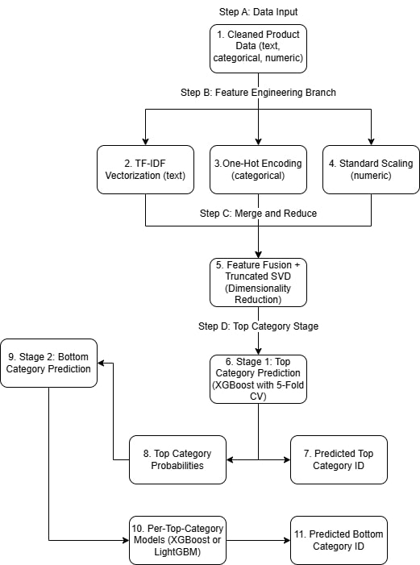
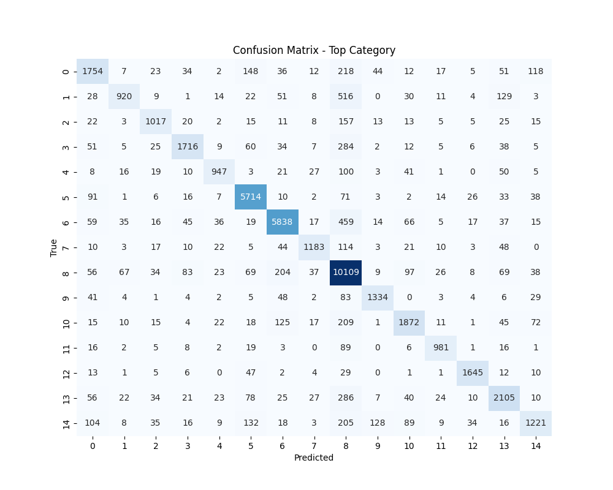
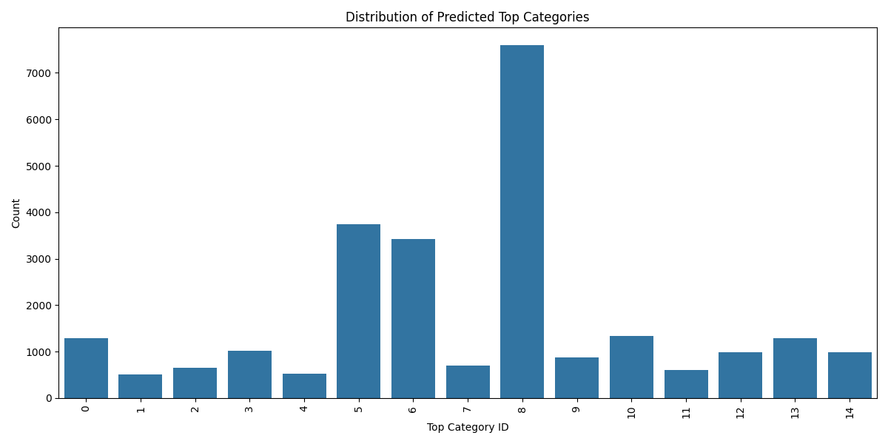
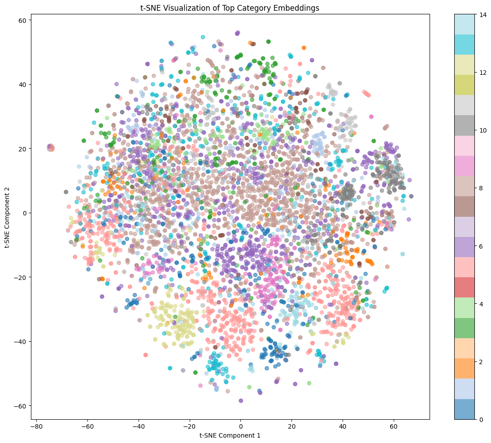
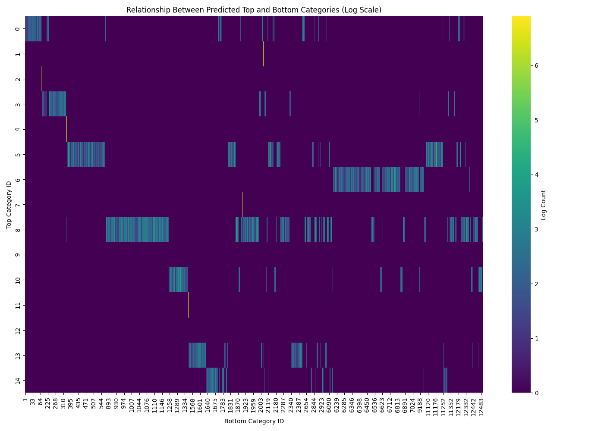
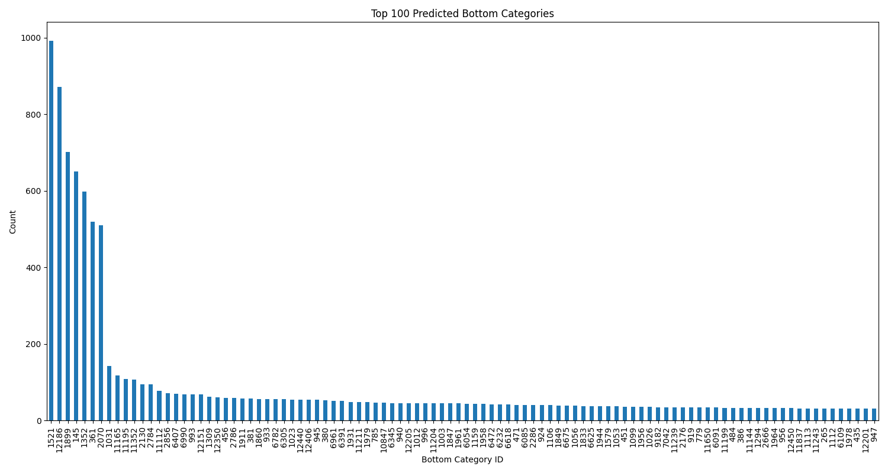
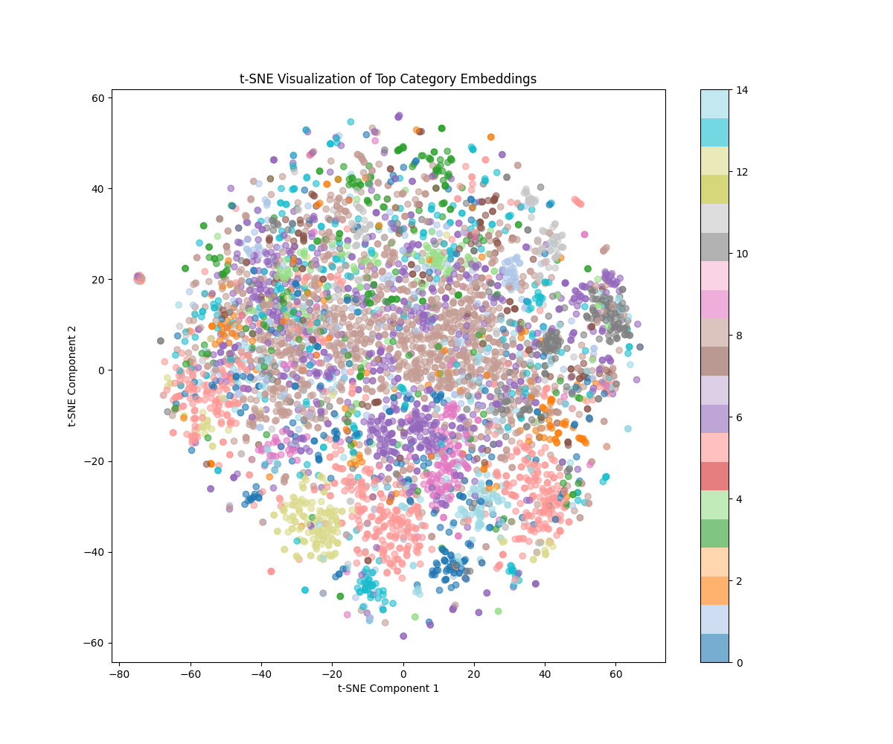

# 🛍️ Product Category Classification Prediction using AI/ML Models

I propose a robust **hierarchical machine learning pipeline** that classifies e-commerce products into both **top-level** and **fine-grained bottom-level categories**. This is based on multimodal metadata (text, categorical, numeric). The pipeline leverages advanced feature engineering, dimensionality reduction, and boosting-based classification techniques.

---

## 📌 Project Highlights

- **Task**: Multimodal product categorization (top and bottom categories)  
- **Input Data**: Cleaned metadata (titles, descriptions, tags, categorical fields)  
- **ML Techniques**: TF-IDF, One-Hot Encoding, TruncatedSVD, XGBoost, LightGBM, SMOTE  
- **Evaluation**: Accuracy, Macro F1, Weighted F1  
- **Visualization**: Confusion matrices, t-SNE embeddings, category distributions  

---

## 🔧 Pipeline Overview

Here’s a clean academic-style flowchart of the full pipeline:



---

## 📂 Data Preprocessing

The project started by aggregating over **350+ Parquet files** (train + test), performing **cleaning and enrichment** on product metadata.

```python
import glob
import pandas as pd

files = glob.glob("/data/train/*.parquet")
etsy_train_df = pd.concat([pd.read_parquet(f) for f in files])

# Cleaning text fields
def clean_text(text):
    text = re.sub(r'[^a-zA-Z0-9\s]', '', text.lower())
    return " ".join([lemmatizer.lemmatize(w) for w in word_tokenize(text) if w not in stop_words])

etsy_train_df['description_clean'] = etsy_train_df['description'].apply(clean_text)
```

---

## ✨ Feature Representation

I process three types of features:

- **TF-IDF** on combined text features (title, description, tags)  
- **One-Hot Encoding** for fields like material, room, recipient  
- **Standard Scaling** for numerical metadata (lengths, color ids)  

Then I perform **dimensionality reduction** using TruncatedSVD:

```python
from sklearn.decomposition import TruncatedSVD
X_text = tfidf_vectorizer.fit_transform(etsy_train_df['combined_text'])
svd = TruncatedSVD(n_components=300, random_state=42)
X_text_svd = svd.fit_transform(X_text)
```

---

## 🎯 Stage 1: Top Category Classification

I first predict the **top category** using **XGBoost** with 5-Fold Cross Validation:

```python
model = xgb.XGBClassifier(tree_method='gpu_hist', n_estimators=300, max_depth=15)
scores = cross_val_score(model, X_train_svd, y_top, cv=5, scoring='f1_macro')
```

### ✅ Confusion Matrix for Top Category  


### 📊 Top Category Distribution  


### 🌐 t-SNE Visualization of Top Category Embeddings  


---

## 🧠 Stage 2: Bottom Category Prediction

For each **predicted top category**, I train a **dedicated classifier** (XGBoost/LightGBM) using the same reduced feature space plus **top category probabilities** as features.

```python
for top_cat in unique_top_categories:
    X_top = X_train_enhanced[y_top_train == top_cat]
    y_bottom = y_bottom_train[y_top_train == top_cat]
    clf = lgb.LGBMClassifier(...)
    clf.fit(X_top, y_bottom)
```

### 🧩 Top-Bottom Category Relationship Heatmap  


---

## 📉 Evaluation Results

| Model                            | Accuracy   | Macro F1   | Weighted F1 |
|----------------------------------|------------|------------|--------------|
| Top Category (XGBoost)           | **80.88%** | **0.7778** | **0.8052**   |
| Bottom Category (Hierarchical)  | ~**25.19%** | ~**0.2464**  | (Varies)     |

### 🔢 Bottom Category Distribution  


---

## 💡 Visual Insights

### t-SNE Embeddings with Top Labels  


---

## 🔍 Challenges & Future Work

- **Imbalance**: Many bottom categories have <50 samples. SMOTE helps but has limits.  
- **Scalability**: Training hundreds of bottom classifiers (some with 400+ classes) is time and memory intensive.  
- **Feature drift**: Low signal in some text categories like tags or shape.  

🔮 In future work, I aim to:
- Replace TF-IDF + SVD with Sentence-BERT  
- Experiment with end-to-end transformers like HierBERT  
- Introduce Meta-Learning for cross-category generalization  

---

## 📁 Model & Dataset Access

Due to NDA constraints, the **Etsy dataset cannot be shared**.

```markdown
⚠️ Dataset not available due to NDA restrictions with Etsy Inc.
```

### 🔗 Model Files

- **Top Model** (XGBoost with CV): [Download](https://huggingface.co/abhimlv/top-category-xgboost-classifier/tree/main)  
- **Bottom Models** (per top category): [Download](https://huggingface.co/abhimlv/bottom-category-hierarchical-classifier/tree/main)

---

## 🧠 Summary

This project delivers a scalable and interpretable **hierarchical product categorization system**. By breaking down the classification task into top and bottom predictions, I align with the way marketplaces organize products and demonstrate strong performance across diverse product types.
